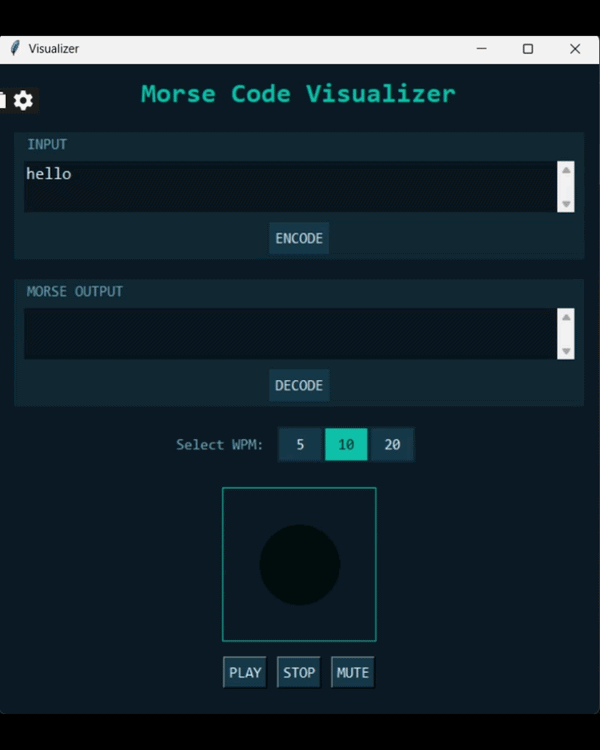

#Morse Code Visualizer

A Python-based Morse Code encoder, decoder, and visualizer with LED simulation and audio playback.

## Features
- Encode text into Morse code
- Decode Morse code into text
- Real-time LED visualization
- Adjustable WPM (5, 10, 20)
- Audio playback for dots and dashes
- Highlighting of current Morse symbol

## Tech Stack
- Python
- Tkinter (GUI)
- Pygame (audio)

## Project Structure
morse-code-project/
│
├── main.py
├── morse_audio/
│   ├── dot_5.wav
│   ├── dash_5.wav
│   ├── ...

## How to Run

### 1. Install dependencies - pip install pygame
### 2. Run the visualizer - morse.py -V

## Demo

  

## Author
Elijah Shylla

## Version
1.0